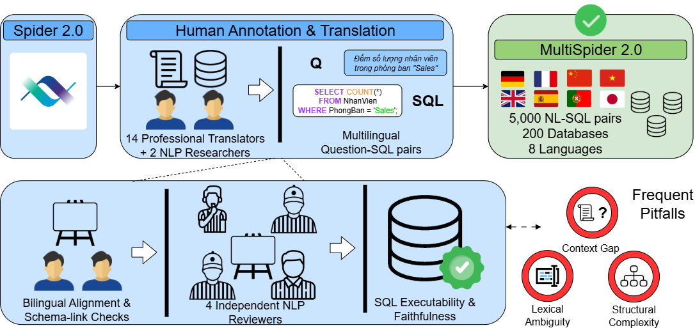

[](https://arxiv.org/abs/2509.24405)

# Multilingual Text-to-SQL: MultiSpider 2.0

MultiSpider 2.0 is a multilingual, enterprise-scale Text-to-SQL benchmark designed to stress schema linking, compositional SQL reasoning, and cross-lingual generalization. This repository collects multilingual question files, database assets, and benchmark references for building and evaluating Text-to-SQL systems beyond English-only settings.

> Accepted at the 36th Australasian Database Conference (ADC 2025): [conference chapter](https://link.springer.com/chapter/10.1007/978-981-95-6196-4_8)

<p align="center">
  
</p>

<p align="center">
  <em>Dataset construction and validation pipeline used for MultiSpider 2.0.</em>
</p>

## Why MultiSpider 2.0

- 8 languages: English, German, French, Spanish, Portuguese, Japanese, Chinese, and Vietnamese.
- Enterprise-oriented schemas spanning BigQuery, Snowflake, and SQLite.
- Hard compositional SQL with nested logic, multi-hop joins, functions, and dialect variation.
- Strong baselines still struggle: reasoning-only LLMs reach only about 4-6% execution accuracy on MultiSpider 2.0, while COLA raises that range to roughly 12-16%.

> [!NOTE]
> The benchmark tables below are transcribed from the paper for quick reference. The paper reports the full MultiSpider 2.0 benchmark, while the current `questions/` directory in this repository snapshot contains multilingual `spider2-lite` JSONL files.

## What Is In This Repo

- [databases/](databases/) contains exported schemas, metadata, and local database assets grouped by engine.
- [questions/](questions/) contains multilingual `spider2-lite_*.jsonl` files, one file per language.
- [resources/](resources/) contains figures used in the documentation.

## Quick Start

1. Open a language file in [questions/](questions/), such as [questions/spider2-lite_en.jsonl](questions/spider2-lite_en.jsonl).
2. Read the `db` field to locate the matching database inside [databases/](databases/).
3. Use the `external_knowledge` field to find the supporting documentation for that example.
4. Generate or evaluate SQL against the corresponding schema and SQL dialect.

## Dataset Snapshot

### Statistics of MultiSpider 2.0 Task Features

<table>
  <thead>
    <tr>
      <th>Task Feature</th>
      <th>Sub-feature</th>
      <th>Number (% of total)</th>
    </tr>
  </thead>
  <tbody>
    <tr>
      <td rowspan="2">Overall statistics</td>
      <td>Total examples</td>
      <td>5056 (100%)</td>
    </tr>
    <tr>
      <td>Total languages</td>
      <td>8</td>
    </tr>
    <tr>
      <td rowspan="8">Linguistic distribution</td>
      <td>English (en)</td>
      <td>632 (12.5%)</td>
    </tr>
    <tr>
      <td>German (de)</td>
      <td>632</td>
    </tr>
    <tr>
      <td>French (fr)</td>
      <td>632</td>
    </tr>
    <tr>
      <td>Spanish (es)</td>
      <td>632</td>
    </tr>
    <tr>
      <td>Portuguese (pt)</td>
      <td>632</td>
    </tr>
    <tr>
      <td>Japanese (ja)</td>
      <td>632</td>
    </tr>
    <tr>
      <td>Chinese (zh)</td>
      <td>632</td>
    </tr>
    <tr>
      <td>Vietnamese (vi)</td>
      <td>632</td>
    </tr>
    <tr>
      <td rowspan="3">Dataset complexity</td>
      <td>Easy (&lt; 80 tokens)</td>
      <td>1280 (25.32%)</td>
    </tr>
    <tr>
      <td>Medium (80-160 tokens)</td>
      <td>2232 (44.15%)</td>
    </tr>
    <tr>
      <td>Hard (&gt; 160 tokens)</td>
      <td>1544 (30.54%)</td>
    </tr>
    <tr>
      <td rowspan="4">Query and schema complexity</td>
      <td>With multiple schemas</td>
      <td>1120 (22.15%)</td>
    </tr>
    <tr>
      <td>With nested schemas</td>
      <td>936 (18.51%)</td>
    </tr>
    <tr>
      <td>With partition tables</td>
      <td>432 (8.54%)</td>
    </tr>
    <tr>
      <td>With functions</td>
      <td>3792 (75.00%)</td>
    </tr>
    <tr>
      <td rowspan="3">Database dialects</td>
      <td>With BigQuery</td>
      <td>1712 (33.86%)</td>
    </tr>
    <tr>
      <td>With Snowflake</td>
      <td>1584 (31.33%)</td>
    </tr>
    <tr>
      <td>With SQLite</td>
      <td>1760 (34.81%)</td>
    </tr>
  </tbody>
</table>

## Results At A Glance

The paper shows a sharp difficulty jump from MultiSpider 1.0 to MultiSpider 2.0. Execution accuracy collapses for reasoning-only models, exact match remains even lower, and Pass@20 stays below 15%, which underlines how far current systems remain from robust multilingual enterprise Text-to-SQL.

### Pass@N Scores on MultiSpider 2.0

| Method | Pass@5 | Pass@10 | Pass@20 |
| --- | ---: | ---: | ---: |
| Gemini 1.5 Pro | 6.38% | 8.22% | 9.55% |
| OpenAI-o1-1217 | 6.57% | 8.16% | 14.06% |
| DeepSeek-R1-Distill-Qwen-32B | 6.54% | 8.22% | 13.73% |
| DeepSeek-R1-Distill-Qwen-70B | 6.04% | 7.71% | 14.50% |
| COLA + Gemini 1.5 Pro | 6.30% | 8.18% | 12.49% |
| COLA + OpenAI-o1-1217 | 7.38% | 8.48% | 14.88% |
| COLA + DeepSeek-R1-Distill-Qwen-32B | 6.24% | 7.88% | 12.69% |
| COLA + DeepSeek-R1-Distill-Qwen-70B | 6.85% | 8.66% | 14.59% |

---
## Benchmark Results

**Paper note: Tables 1 and 2 print `COLA + DeepSeek-R1-Distill-Llama-70B`, while Table 6 prints `COLA + DeepSeek-R1-Distill-Qwen-70B`. The README preserves the labels exactly as they appear in the paper. In Tables 4 and 5, `-` means the paper did not report a Portuguese score for MultiSpider 1.0.**

### Table 1. Execution accuracy (%) across languages. The top row for each method corresponds to MultiSpider 1.0, while the bottom row corresponds to MultiSpider 2.0.

<table>
  <thead>
    <tr>
      <th>Methods</th>
      <th>en</th>
      <th>de</th>
      <th>fr</th>
      <th>es</th>
      <th>pt</th>
      <th>ja</th>
      <th>zh</th>
      <th>vi</th>
    </tr>
  </thead>
  <tbody>
    <tr><td>DIN-SQL + GPT-4o</td><td>80.55<br>12.98</td><td>80.11<br>12.49</td><td>80.06<br>13.21</td><td>80.48<br>12.87</td><td>-<br>9.10</td><td>78.27<br>8.99</td><td>73.14<br>8.01</td><td>70.51<br>9.13</td></tr>
    <tr><td>DAIL-SQL + GPT-4o</td><td>84.25<br>12.30</td><td>83.32<br>12.13</td><td>83.76<br>13.05</td><td>83.45<br>14.76</td><td>-<br>10.94</td><td>72.18<br>8.43</td><td>78.68<br>9.04</td><td>82.37<br>8.36</td></tr>
    <tr><td>TAG-Bench + GPT-4o</td><td>81.53<br>12.56</td><td>81.40<br>13.30</td><td>81.04<br>14.01</td><td>81.34<br>13.78</td><td>-<br>9.24</td><td>70.25<br>11.86</td><td>76.83<br>8.31</td><td>73.89<br>10.26</td></tr>
    <tr><td>RESDSQL + GPT-4o</td><td>81.55<br>12.69</td><td>80.85<br>14.17</td><td>80.47<br>14.71</td><td>80.09<br>12.59</td><td>-<br>8.38</td><td>75.46<br>8.88</td><td>78.27<br>9.05</td><td>73.23<br>11.60</td></tr>
    <tr><td>C3SQL + GPT-4o</td><td>81.53<br>13.32</td><td>81.15<br>13.02</td><td>81.28<br>14.00</td><td>81.59<br>14.73</td><td>-<br>8.98</td><td>79.20<br>8.71</td><td>78.92<br>9.83</td><td>77.49<br>11.18</td></tr>
    <tr><td>PETSQL + GPT-4o</td><td>81.29<br>13.22</td><td>80.69<br>12.02</td><td>80.33<br>13.05</td><td>80.96<br>13.54</td><td>-<br>10.38</td><td>70.68<br>9.79</td><td>74.54<br>10.79</td><td>78.73<br>8.22</td></tr>
    <tr><td>CHESS + GPT-4o</td><td>82.18<br>12.09</td><td>81.95<br>13.38</td><td>81.70<br>14.15</td><td>80.61<br>12.14</td><td>-<br>10.92</td><td>76.37<br>9.32</td><td>78.70<br>9.55</td><td>71.65<br>11.94</td></tr>
    <tr><td>Gemini 1.5 Pro</td><td>79.69<br>4.87</td><td>78.95<br>4.23</td><td>79.05<br>3.04</td><td>78.91<br>4.05</td><td>-<br>4.58</td><td>78.96<br>3.91</td><td>76.16<br>4.50</td><td>77.21<br>5.61</td></tr>
    <tr><td>OpenAI-o1-1217</td><td>79.67<br>4.37</td><td>78.71<br>5.42</td><td>78.21<br>5.80</td><td>78.53<br>4.41</td><td>-<br>5.55</td><td>79.88<br>4.58</td><td>78.95<br>5.41</td><td>78.03<br>5.20</td></tr>
    <tr><td>DeepSeek-R1-Distill-Qwen-32B</td><td>79.54<br>5.32</td><td>79.27<br>5.21</td><td>79.78<br>5.24</td><td>76.62<br>5.22</td><td>-<br>4.73</td><td>76.15<br>4.23</td><td>77.25<br>5.52</td><td>76.69<br>4.14</td></tr>
    <tr><td>DeepSeek-R1-Distill-Qwen-70B</td><td>80.01<br>5.83</td><td>79.15<br>5.61</td><td>79.37<br>5.46</td><td>79.68<br>5.47</td><td>-<br>5.33</td><td>78.40<br>5.64</td><td>79.65<br>5.89</td><td>77.10<br>5.22</td></tr>
    <tr><td>COLA + Gemini 1.5 Pro</td><td>89.23<br>15.68</td><td>86.34<br>15.26</td><td>87.65<br>14.85</td><td>86.38<br>14.55</td><td>-<br>13.97</td><td>81.95<br>12.11</td><td>82.02<br>13.66</td><td>80.94<br>12.44</td></tr>
    <tr><td>COLA + OpenAI-o1-1217</td><td>94.95<br>15.92</td><td>92.23<br>16.20</td><td>91.97<br>15.14</td><td>91.95<br>14.23</td><td>-<br>15.53</td><td>83.45<br>13.43</td><td>84.46<br>13.43</td><td>82.15<br>12.49</td></tr>
    <tr><td>COLA + DeepSeek-R1-Distill-Qwen-32B</td><td>90.95<br>15.43</td><td>91.23<br>14.02</td><td>90.49<br>15.58</td><td>90.54<br>14.56</td><td>-<br>13.12</td><td>81.94<br>14.45</td><td>80.17<br>15.74</td><td>80.26<br>13.83</td></tr>
    <tr><td>COLA + DeepSeek-R1-Distill-Llama-70B</td><td>92.24<br>15.94</td><td>93.37<br>15.23</td><td>91.92<br>15.94</td><td>91.01<br>14.88</td><td>-<br>14.83</td><td>86.39<br>13.37</td><td>89.21<br>14.78</td><td>82.04<br>13.59</td></tr>
  </tbody>
</table>

### Table 2. Exact matching accuracy (%) across languages. The top row for each method corresponds to MultiSpider 1.0, while the bottom row corresponds to MultiSpider 2.0.

<table>
  <thead>
    <tr>
      <th>Methods</th>
      <th>en</th>
      <th>de</th>
      <th>fr</th>
      <th>es</th>
      <th>pt</th>
      <th>ja</th>
      <th>zh</th>
      <th>vi</th>
    </tr>
  </thead>
  <tbody>
    <tr><td>DIN-SQL + GPT-4o</td><td>72.47<br>11.37</td><td>68.96<br>8.57</td><td>65.70<br>13.07</td><td>65.70<br>8.73</td><td>-<br>5.05</td><td>54.67<br>6.19</td><td>58.46<br>6.42</td><td>58.01<br>7.72</td></tr>
    <tr><td>DAIL-SQL + GPT-4o</td><td>74.03<br>13.81</td><td>72.37<br>8.92</td><td>71.52<br>9.49</td><td>67.25<br>9.89</td><td>-<br>8.00</td><td>44.71<br>5.31</td><td>45.20<br>7.97</td><td>58.54<br>8.99</td></tr>
    <tr><td>TAG-Bench + GPT-4o</td><td>71.91<br>8.31</td><td>66.67<br>13.14</td><td>72.22<br>12.73</td><td>72.50<br>9.02</td><td>-<br>5.65</td><td>53.73<br>6.21</td><td>43.75<br>5.19</td><td>54.55<br>7.39</td></tr>
    <tr><td>RESDSQL + GPT-4o</td><td>70.78<br>11.44</td><td>72.01<br>9.23</td><td>67.53<br>12.85</td><td>66.30<br>12.74</td><td>-<br>7.64</td><td>41.83<br>6.19</td><td>55.81<br>5.57</td><td>56.03<br>7.69</td></tr>
    <tr><td>C3SQL + GPT-4o</td><td>67.85<br>12.09</td><td>69.77<br>11.97</td><td>68.77<br>14.42</td><td>68.70<br>8.61</td><td>-<br>5.58</td><td>51.39<br>7.70</td><td>52.15<br>6.52</td><td>53.30<br>5.75</td></tr>
    <tr><td>PETSQL + GPT-4o</td><td>71.08<br>11.86</td><td>69.28<br>8.11</td><td>65.02<br>14.33</td><td>73.77<br>10.08</td><td>-<br>7.46</td><td>50.42<br>7.65</td><td>48.83<br>6.74</td><td>53.52<br>6.00</td></tr>
    <tr><td>CHESS + GPT-4o</td><td>68.65<br>10.17</td><td>65.04<br>11.96</td><td>71.94<br>12.39</td><td>66.96<br>11.01</td><td>-<br>5.69</td><td>50.80<br>7.75</td><td>52.07<br>5.23</td><td>56.03<br>7.68</td></tr>
    <tr><td>Gemini 1.5 Pro</td><td>65.28<br>4.44</td><td>73.87<br>3.69</td><td>72.86<br>2.55</td><td>73.13<br>4.59</td><td>-<br>2.62</td><td>46.72<br>3.58</td><td>58.82<br>3.46</td><td>52.12<br>2.90</td></tr>
    <tr><td>OpenAI-o1-1217</td><td>67.72<br>3.64</td><td>68.50<br>4.43</td><td>68.81<br>2.16</td><td>66.79<br>4.47</td><td>-<br>4.51</td><td>48.55<br>3.67</td><td>56.18<br>3.78</td><td>49.16<br>3.53</td></tr>
    <tr><td>DeepSeek-R1-Distill-Qwen-32B</td><td>69.54<br>4.45</td><td>69.27<br>3.14</td><td>69.78<br>3.94</td><td>70.62<br>4.52</td><td>-<br>2.64</td><td>47.15<br>2.79</td><td>41.25<br>4.02</td><td>41.69<br>2.43</td></tr>
    <tr><td>DeepSeek-R1-Distill-Qwen-70B</td><td>67.00<br>4.96</td><td>68.15<br>4.25</td><td>71.37<br>4.60</td><td>70.68<br>4.01</td><td>-<br>4.12</td><td>47.40<br>4.13</td><td>58.65<br>4.56</td><td>47.10<br>4.39</td></tr>
    <tr><td>COLA + Gemini 1.5 Pro</td><td>69.70<br>14.57</td><td>65.59<br>10.32</td><td>73.81<br>12.72</td><td>73.58<br>8.76</td><td>-<br>5.17</td><td>51.17<br>6.90</td><td>57.22<br>6.62</td><td>53.79<br>7.44</td></tr>
    <tr><td>COLA + OpenAI-o1-1217</td><td>74.46<br>12.77</td><td>74.68<br>13.90</td><td>74.98<br>11.97</td><td>74.68<br>14.50</td><td>-<br>6.11</td><td>43.40<br>7.82</td><td>50.18<br>5.51</td><td>42.21<br>6.44</td></tr>
    <tr><td>COLA + DeepSeek-R1-Distill-Qwen-32B</td><td>70.52<br>10.99</td><td>71.28<br>12.13</td><td>69.67<br>14.85</td><td>70.12<br>10.88</td><td>-<br>5.92</td><td>48.33<br>6.71</td><td>49.91<br>6.45</td><td>50.45<br>7.22</td></tr>
    <tr><td>COLA + DeepSeek-R1-Distill-Llama-70B</td><td>72.89<br>14.55</td><td>73.12<br>12.67</td><td>71.45<br>12.01</td><td>74.78<br>11.79</td><td>-<br>6.24</td><td>59.14<br>7.15</td><td>59.33<br>6.89</td><td>52.98<br>7.68</td></tr>
  </tbody>
</table>

## Citation

If you use this repository or benchmark, please cite the paper:

```bibtex
@inproceedings{pham2025multilingual,
  title={Multilingual Text-to-SQL: Benchmarking the Limits of Language Models with Collaborative Language Agents},
  author={Pham, Khanh Trinh and Nguyen, Thu Huong and Jo, Jun and Nguyen, Quoc Viet Hung and Nguyen, Thanh Tam},
  booktitle={Australasian Database Conference},
  pages={108--123},
  year={2025},
  organization={Springer}
}
```

## License

MIT
